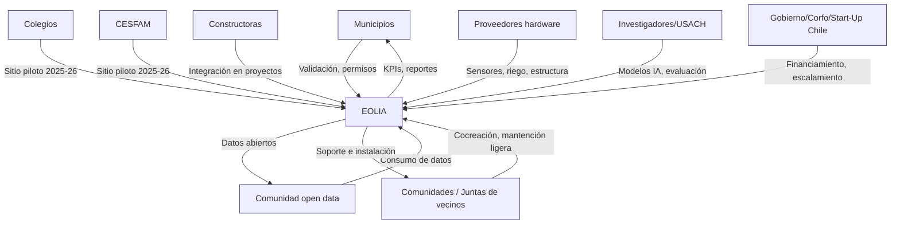
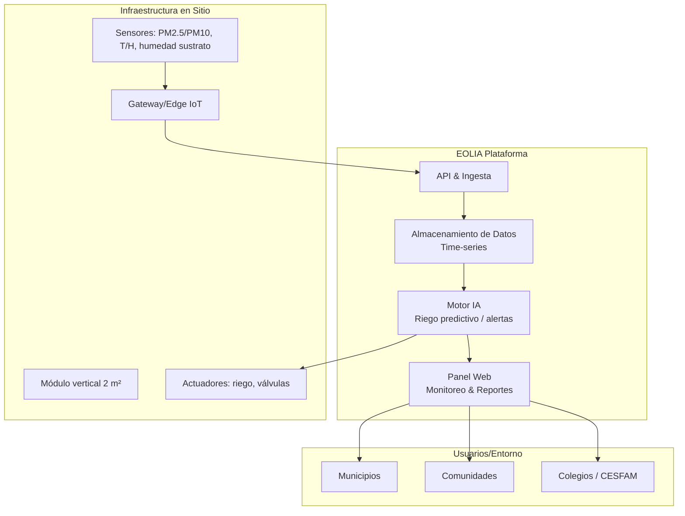
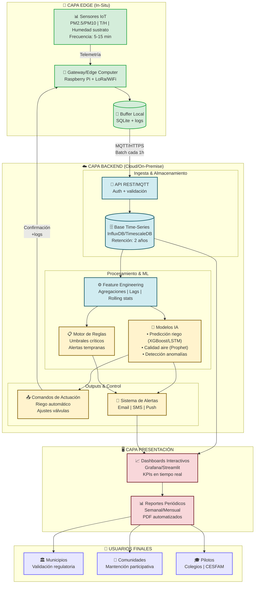

# Diagramas de complejidad

```mermaid
graph TD
  A[Municipios]:::ext -->|Validación, permisos| P[EOLIA]
  B[Comunidades / Juntas de vecinos]:::ext -->|Cocreación, mantención ligera| P
  C[Colegios]:::ext -->|Sitio piloto 2025-26| P
  D[CESFAM]:::ext -->|Sitio piloto 2025-26| P
  E[Constructoras]:::ext -->|Integración en proyectos| P
  F[Proveedores hardware]:::ext -->|Sensores, riego, estructura| P
  G[Investigadores/USACH]:::ext -->|Modelos IA, evaluación| P
  H[Gobierno/Corfo/Start-Up Chile]:::ext -->|Financiamiento, escalamiento| P
  I[Comunidad open data]:::ext -->|Consumo de datos| P
  P -->|KPIs, reportes| A
  P -->|Datos abiertos| I
  P -->|Soporte e instalación| B
  classDef ext fill:#eef,stroke:#447;
```

```mermaid
graph TB
  subgraph Usuarios_Entorno["Usuarios/Entorno"]
    MUN[Municipios]
    COM[Comunidades]
    EDU[Colegios / CESFAM]
  end

  subgraph EOLIA_Plataforma["EOLIA Plataforma"]
    UI["Panel Web
    Monitoreo & Reportes"]
    API[API & Ingesta]
    DS["Almacenamiento de Datos
    Time-series"]
    ML["Motor IA
    Riego predictivo / alertas"]
  end

  subgraph Infraestructura_Sitio["Infraestructura en Sitio"]
    MOD[Módulo vertical 2 m²]
    SENS["Sensores: PM2.5/PM10, T/H, humedad sustrato"]
    ACT["Actuadores: riego, válvulas"]
    EDGE[Gateway/Edge IoT]
  end

  SENS --> EDGE --> API --> DS --> ML --> UI
  ML --> ACT
  UI --> MUN
  UI --> COM
  UI --> EDU
```

```mermaid
flowchart TB
  subgraph Edge["🌱 CAPA EDGE (In-Situ)"]
    direction TB
    SENS["📊 Sensores IoT<br/>PM2.5/PM10 | T/H | Humedad sustrato<br/>Frecuencia: 5-15 min"]
    GATE["🔌 Gateway/Edge Computer<br/>Raspberry Pi + LoRa/WiFi"]
    BUFF[("💾 Buffer Local<br/>SQLite + logs")]
    
    SENS -->|Telemetría| GATE
    GATE --> BUFF
  end

  subgraph Backend["☁️ CAPA BACKEND (Cloud/On-Premise)"]
    direction TB
    
    subgraph Ingesta["Ingesta & Almacenamiento"]
      API["🔗 API REST/MQTT<br/>Auth + validación"]
      TS[("🗄️ Base Time-Series<br/>InfluxDB/TimescaleDB<br/>Retención: 2 años")]
    end
    
    subgraph Procesamiento["Procesamiento & ML"]
      ETL["⚙️ Feature Engineering<br/>Agregaciones | Lags | Rolling stats"]
      ML["🤖 Modelos IA<br/>• Predicción riego (XGBoost/LSTM)<br/>• Calidad aire (Prophet)<br/>• Detección anomalías"]
      RULES["📋 Motor de Reglas<br/>Umbrales críticos<br/>Alertas tempranas"]
    end
    
    subgraph Salidas["Outputs & Control"]
      CMD["📤 Comandos de Actuación<br/>Riego automático<br/>Ajustes válvulas"]
      ALERT["🚨 Sistema de Alertas<br/>Email | SMS | Push"]
    end
  end

  subgraph Presentacion["🖥️ CAPA PRESENTACIÓN"]
    direction TB
    DASH["📈 Dashboards Interactivos<br/>Grafana/Streamlit<br/>KPIs en tiempo real"]
    REP["📊 Reportes Periódicos<br/>Semanal/Mensual<br/>PDF automatizados"]
  end

  subgraph Usuarios["👥 USUARIOS FINALES"]
    MUN["🏛️ Municipios<br/>Validación regulatoria"]
    COM["🤝 Comunidades<br/>Mantención participativa"]
    PIL["🎓 Pilotos<br/>Colegios | CESFAM"]
  end

  %% Flujos principales
  BUFF -->|"MQTT/HTTPS<br/>Batch cada 1h"| API
  API --> TS
  TS --> ETL
  ETL --> ML
  ETL --> RULES
  
  ML --> CMD
  ML --> ALERT
  RULES --> ALERT
  
  CMD -->|"Confirmación<br/>+logs"| GATE
  
  TS --> DASH
  ALERT --> DASH
  DASH --> REP
  
  REP --> MUN
  REP --> COM
  REP --> PIL

  %% Estilos
  classDef edgeStyle fill:#d4edda,stroke:#28a745,stroke-width:2px
  classDef backendStyle fill:#d1ecf1,stroke:#0c5460,stroke-width:2px
  classDef mlStyle fill:#fff3cd,stroke:#856404,stroke-width:2px
  classDef presentStyle fill:#f8d7da,stroke:#721c24,stroke-width:2px
  classDef userStyle fill:#e7e7ff,stroke:#6c63ff,stroke-width:2px
  
  class SENS,GATE,BUFF edgeStyle
  class API,TS,ETL backendStyle
  class ML,RULES,CMD,ALERT mlStyle
  class DASH,REP presentStyle
  class MUN,COM,PIL userStyle
```